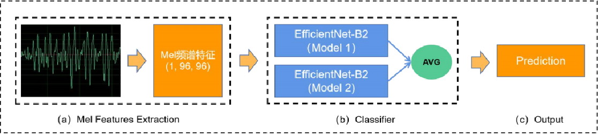

# FMFCC Audio Deepfake Detection Solution
This repo provides an solution for the [多媒体伪造取证大赛](http://fmfcc.net). 
Our solution achieve the 1st in the Audio Deepfake Detection track .
The ranking can be seen [here](http://fmfcc.net/contest-introduction)

## Authors
Institution: Shenzhen Key Laboratory of Media Information Content Security(MICS)

Team name: Forensics_SZU  

Username: 
- [Baoying Chen](https://github.com/beibuwandeluori) email: 1900271059@email.szu.edu.cn
- [Yuankun Huang]
- [Siyu Mei]
## Pipeline
### EfficientNet-B2 + mel features (不同mel参数的训练两个模型ensemble)

1) 对音频进行分割，每隔 0.96 秒提取音频 mel 特征（维度为[1, 96, 96]）；
2) 使用EfficientNet-B2作为分类模型，修改输入通道为1，加载ImageNet的预训练权值；
3) 分类模型采取两种方式训练， Model1 是窗口长度和步长都是 0.96s，无重叠分割音频，Mode2 是窗口为 0.96s,而步长为 0.48 秒，有重叠分割音频；
4) 一个完整音频的mel特征维度为[n, 96, 96], 每个模型对n个[1, 96, 96]特征预测后求均值得到预测值，然后将两种模型对音频的预测值的平均值作为最终的预测值。

## Requirements:
* 激活已经配置好的环境[建议使用这个]
```
conda activate audio
```
* 或者执行这个重新配置
```
pip install -r requirements.txt
```
* 可能存在部分包漏了安装，可以通过pip install 方式继续安装完整

## Submission
* cd到代码位置：/home/audio5/py_project/CSIG_audio
```
cd /home/audio5/py_project/CSIG_audio
```
* 接着，修改inference.py 文件的第98行中的root_path路劲为自己语音测试集的路劲
### 1. 预测第一个模型
* 然后执行
```
python inference.py
```
* 运行结束后，可以在 "./output/results/efficientnet-b2_96_k2e6_hop48_t' 看到results.json文件
### 2. 预测第二个模型
* 2.1 修改json_root的路劲：把inference.py的105行的代码注释掉，
然后解除106行的注释，更新了第二个模型预测结果保存的路劲，修改后的代码如下
```
105        # json_root = f'./output/results/{model_name}_96_k2e6_hop48_t'
106        json_root = f'./output/results/{model_name}_96_k2e9_t'
```
* 2.2 修改model_path的路劲（即改变模型权值）：把inference.py的114行的代码注释掉，
然后解除115行的注释，更新了模型权值的路劲，修改后的代码如下
```
114        # model_path = './output/weights/efficientnet-b2_96_hop48_k2/audio6_acc0.9832.pth'
115        model_path = './output/weights/efficientnet-b2_96_k2/audio9_acc0.9752.pth'
```
* 2.3 修改mel feature的配置参数：把dataset/preprocess/vggish_params.py中的
35行代码"EXAMPLE_HOP_SECONDS = 0.48" 改为"EXAMPLE_HOP_SECONDS = 0.96" 
特别要注意EXAMPLE_HOP_SECONDS这个参数，验证结束后，需要重新修改为0.48， 方便最终决赛运行
* 修改上述三点后，然后执行， 另外前面的两个修改也需要恢复。
```
python inference.py
```
* 运行结束后，可以在 "./output/results/efficientnet-b2_96_k2e9_t' 看到results.json文件
## Ensemble 
* 集成刚刚生成的两个json文件：把inference.py 第88行的"json_ensemble = False"改为"json_ensemble = True"
* 修改后执行：
```
python inference.py
```
* 运行结束后，可以在 "./output/results/ensemble_01_t' 看到results.json文件，该文件就是我们最终提交的结果json文件

### 注意：验证结束后，需要恢复上述修改到原始状态，方便最终的决赛